aws ssm put-parameter \                                                                                            <region:us-east-1> 
    --name "/github/token" \
    --value "xxxxx" \
    --type SecureString

```mermaid

graph TD
    %% Define User
    User((Web & Mobile Clients))

    %% Phase 1 & 4: Edge & Routing
    subgraph "Edge Layer (Phases 1 & 4)"
        Route53[Amazon Route 53 DNS]
        CloudFront[Amazon CloudFront CDN]
        WAF{AWS WAF}
    end

    %% API & Routing Layer
    subgraph "Traffic Routing Layer (Phase 4)"
        APIGW[API Gateway - OrderProcessingAPI]
        ALB[Application Load Balancer]
    end

    %% Phase 1: VPC Foundation
    subgraph "Amazon VPC (Phase 1)"
        NAT[NAT Gateway]
        
        subgraph "Private Subnets (The Vault)"
            ECS[Amazon ECS Fargate Containers]
            RDS[(Amazon RDS PostgreSQL)]
            ElastiCache[(ElastiCache Valkey)]
        end
    end

    %% Phase 3: Serverless Compute
    subgraph "Serverless Compute (Phase 3)"
        Worker1[Lambda: ProcessOrderWorker]
        Worker2[Lambda: ReceiptGenerator]
    end

    %% Phase 2: Data & Storage
    subgraph "Data & Storage (Phase 2)"
        DynamoDB[(Amazon DynamoDB)]
        S3[Amazon S3 Storage]
    end

    %% Phase 5: Integration
    subgraph "Integration & Decoupling (Phase 5)"
        SNS((SNS: OrderCreatedTopic))
        SQS[[SQS: ReceiptQueue]]
    end

    %% Phase 6: Observability & DevOps
    subgraph "Monitoring & DevOps (Phase 6)"
        CW[Amazon CloudWatch]
        XRay[AWS X-Ray]
        ECR[Amazon ECR]
        CICD[CodePipeline & CodeBuild]
    end

    %% ---- THE CONNECTIONS & TRAFFIC FLOW ----

    %% User to Edge
    User --> Route53
    Route53 --> CloudFront
    CloudFront --- WAF

    %% Edge to Routing & Storage
    CloudFront -->|Static Files| S3
    CloudFront -->|Dynamic Web Traffic| ALB
    CloudFront -->|API Calls| APIGW

    %% Routing to Compute
    ALB -->|Port 8080| ECS
    APIGW -->|POST /orders| Worker1

    %% Compute to State
    ECS -->|SQL queries| RDS
    ECS -->|Cache hits| ElastiCache
    Worker1 -->|NoSQL writes| DynamoDB
    Worker1 -.->|ENI Connection| RDS

    %% The Fan-Out Decoupling Flow
    ECS -->|Broadcasts Event| SNS
    Worker1 -->|Broadcasts Event| SNS
    SNS -->|Fan-out| SQS
    SQS -->|Triggers| Worker2

    %% DevOps & Monitoring (Dotted lines for background processes)
    CICD -.->|Pushes Docker Image| ECR
    ECR -.->|Pulls Image| ECS
    Worker1 -.->|Logs & Traces| CW
    Worker2 -.->|Logs & Traces| CW
    ECS -.->|Logs| CW
    Worker1 -.-> XRay
    Worker2 -.-> XRay
    
    %% Placeholder for custom steps
    
    CICD -.-> CustomSteps
```

The Front Door: The user hits Route 53 and CloudFront. The WAF acts as a shield (--- line) protecting the CDN.

The Split: CloudFront is smart. It grabs images from S3, sends web app traffic to the ALB, and sends data requests to the API Gateway.

The Work: The API Gateway hits your ProcessOrderWorker Lambda. The Lambda saves state to DynamoDB.

The Nervous System: The Lambda shouts to the SNS Topic, which drops the message into the SQS Queue, which wakes up the ReceiptGenerator Lambda safely in the background.

The Security Cameras: Those dotted lines (-.->) at the bottom represent all your resources quietly sending their health data to CloudWatch and X-Ray without slowing down the user experience.