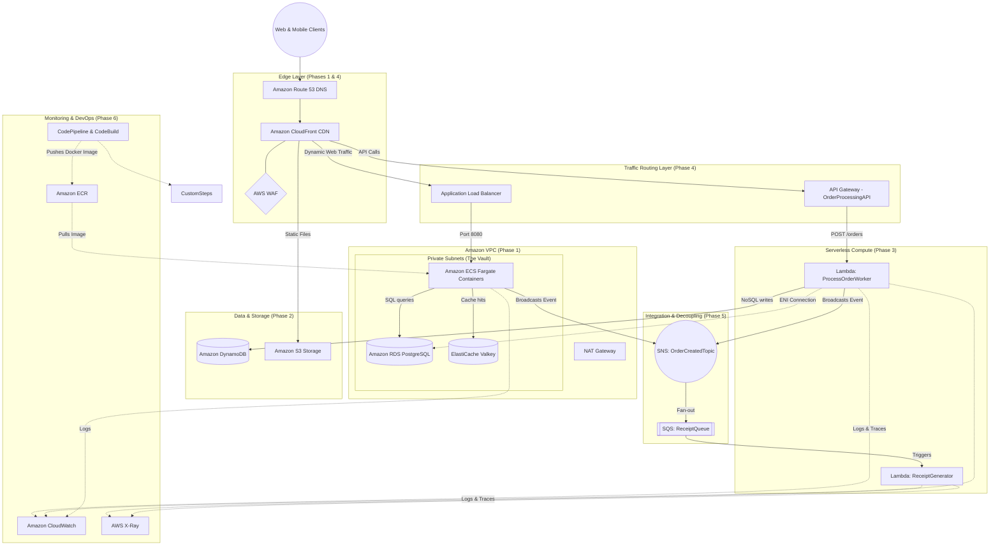

## AWS event driven microservices.

In progress .......

Microservices decoupled architecture with distinct paths, container and serverless pathways.

### Design




The Front Door: The user hits Route 53 and CloudFront. The WAF acts as a shield (--- line) protecting the CDN.

The Split: CloudFront is smart. It grabs images from S3, sends web app traffic to the ALB, and sends data requests to the API Gateway.

The Work: The API Gateway hits your ProcessOrderWorker Lambda. The Lambda saves state to DynamoDB.

The Nervous System: The Lambda shouts to the SNS Topic, which drops the message into the SQS Queue, which wakes up the ReceiptGenerator Lambda safely in the background.

The Security Cameras: Those dotted lines (-.->) at the bottom represent all your resources quietly sending their health data to CloudWatch and X-Ray without slowing down the user experience.
## docker

```
1. Authenticate Docker with AWS
aws ecr get-login-password --region us-east-1 | docker login --username AWS --password-stdin 230150030147.dkr.ecr.us-east-1.amazonaws.com

2. Build the Docker Image Locally
docker build -t coffeeshop-app .

3. Tag the Image for AWS
docker tag coffeeshop-app:latest 230150030147.dkr.ecr.us-east-1.amazonaws.com/coffeeshop-app:latest

4. Push the Image to ECR
docker push 230150030147.dkr.ecr.us-east-1.amazonaws.com/coffeeshop-app:latest
```

## X-Ray, 

```
# 1. Create a new private repository for the X-Ray daemon
aws ecr create-repository --repository-name xray-daemon --region us-east-1

# 2. Log in (just in case your session expired)
aws ecr get-login-password --region us-east-1 | docker login --username AWS --password-stdin 230150030147.dkr.ecr.us-east-1.amazonaws.com

# 3. Pull the public X-Ray daemon image to your laptop
docker pull amazon/aws-xray-daemon:latest

# 4. Re-tag it for your private AWS registry
docker tag amazon/aws-xray-daemon:latest 230150030147.dkr.ecr.us-east-1.amazonaws.com/xray-daemon:latest

# 5. Push the image securely into your private ECR vault
docker push 230150030147.dkr.ecr.us-east-1.amazonaws.com/xray-daemon:latest
```

## Connect to Container

### Drop into an interactive shell

```
aws ecs list-tasks --cluster CoffeeShopEcsCluster

aws ecs execute-command \
    --cluster CoffeeShopEcsCluster \
    --task <YOUR_TASK_ID> \
    --container AppContainer \
    --interactive \
    --command "/bin/sh"
```

 eg: install: ```apt-get update && apt-get install -y curl```,  ```curl -I https://xray.us-east-1.amazonaws.com```

```
# 1. Test the FastAPI health endpoint (This automatically generates an X-Ray trace!)
curl -s http://localhost:8080/health && echo -e "\n"

# 2. Test the Database Configuration endpoint (Proves Secrets Manager is working!)
curl -s http://localhost:8080/config-check && echo -e "\n"

# 3. Power-User Trick: Verify the X-Ray sidecar daemon is actively listening for UDP traces on port 2000
bash -c 'echo -n "" > /dev/udp/127.0.0.1/2000 && echo "X-Ray Daemon is actively listening!" || echo "Daemon not reachable"'
```